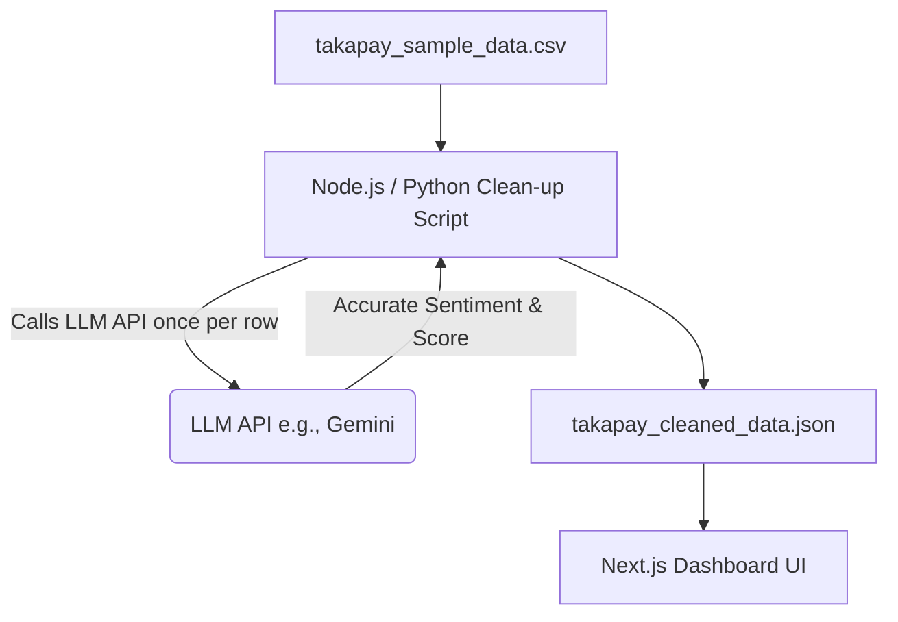

# TakaPay Sentiment Analysis — Data Quality & Pipeline Plan

This document outlines the strategy for correcting the sentiment misclassification in the TakaPay dataset (specifically relating to code-mixed Banglish/English terms like *"receiver pay nai"*, *"atke ache"*, etc.).

---

## 1. The Issue: Banglish Mislabeling

Standard sentiment classifiers fail to recognize Bengali words transliterated into English script (Banglish) or negative sentiment wrapped in sarcasm/local context. 

### Examples of Mislabeled Rows:
*   **Row 379:** `"1500 taka TakaPay theke katlo but receiver pay nai. 1 week dhore atke ache."`
    *   *Current Label:* `positive` (Sentiment Score: `94`) — **Incorrect**
    *   *Actual Sentiment:* `negative` (Failed Transaction)
*   **Row 393:** `"TakaPay diye ma ke 300 taka pathalam, 30 min hoye gelo ekhono pending!"`
    *   *Current Label:* `positive` (Sentiment Score: `76`) — **Incorrect**
    *   *Actual Sentiment:* `negative` (Failed Transaction)
*   **Row 397:** `"Why is TakaPay charging 15 taka to cash out 2000? This is robbery."`
    *   *Current Label:* `positive` (Sentiment Score: `78`) — **Incorrect**
    *   *Actual Sentiment:* `negative` (Charges & Fees)

---

## 1.1 Cleaning & Feature Engineering Requirements

Our custom cleaning tool will apply the following transformations to the raw data:

1. **Zero False Positives / Negatives:** Use the LLM batching model to re-evaluate and correct any mislabeled sentiments (e.g. mapping actual transaction failures from `positive` to `negative`).
2. **Deduplication:** Remove exact text duplicates to prevent spam or bot activities from artificially inflating or skewing the sentiment metrics.
3. **Brand Relevance Filtering:** Automatically set `brand_mention = false` for any post categorized as `off_topic` or where the brand name ("TakaPay") is not actually mentioned.
4. **Feature Engineering:** Add new fields to the output JSON to make frontend dashboard metrics easier to calculate:
   *   `engagement`: Calculated as `reactions + comments` to measure the reach of the post.
   *   `is_competitor_comparison`: Boolean flag if the post mentions competitors like "NgoodPay".
   *   `is_high_risk`: Boolean flag for posts that are `negative` AND have high `engagement` (e.g., above 100), signifying a potential viral PR crisis.
   *   `english_translation`: For comments written in Bengali or Banglish, we will generate a clear English translation so non-Bengali stakeholders can understand them easily.
   *   `severity_level`: Every negative post is classified as `Urgent`, `High`, or `Medium` severity based on the topic (e.g., transaction failure vs. general complaint) and engagement level.
   *   `mentioned_competitors`: An array of strings containing competitor names (e.g. `["NgoodPay"]`) found in the post text.

---

## 2. Approved Solution: Built-in Cleaning Tool & Build Pipeline

Instead of a live backend or manual edits, we will build a CLI tool/script as part of our codebase. 

### The Flow:
1. **Clean Stage:** Run the pipeline tool (`npm run data:clean`) which reads the raw `takapay_sample_data.csv`, processes it using our correction logic and LLM refinement, and writes a clean JSON file.
2. **Dashboard Stage:** The Next.js dashboard reads directly from the generated cleaned dataset.

This ensures data integrity and high performance without runtime API latency.

### Proposed Architecture



### Reference Node.js Cleaning Script (`scripts/clean-dataset.js`)

Below is a template script that reads the CSV, groups them into batches of 50, corrects them using a single prompt per batch, and saves the output.

```javascript
import fs from 'fs';
import csv from 'csv-parser';
import { GoogleGenAI } from '@google/genai';

const ai = new GoogleGenAI({ apiKey: process.env.GEMINI_API_KEY });
const inputPath = './takapay_sample_data.json';
const outputPath = './src/data/takapay_cleaned_data.json';

async function cleanData() {
  const fileContent = fs.readFileSync(inputPath, 'utf8');
  const records = JSON.parse(fileContent);
  
  console.log(`Loaded ${records.length} records. Starting batched LLM refinement...`);
  
  const BATCH_SIZE = 50;
  const cleanedRecords = [];

  for (let i = 0; i < records.length; i += BATCH_SIZE) {
    const batch = records.slice(i, i + BATCH_SIZE);
    console.log(`Processing batch ${Math.floor(i / BATCH_SIZE) + 1} of ${Math.ceil(records.length / BATCH_SIZE)}...`);

    // We only send the texts that actually need translation/sentiment analysis to save tokens
    const promptItems = batch.map((r, index) => ({
      index: index,
      id: r.id,
      text: r.text,
      reactions: parseInt(r.reactions || 0),
      comments: parseInt(r.comments || 0)
    }));

      try {
        const response = await ai.models.generateContent({
          model: 'gemini-2.5-flash',
          contents: `
            Analyze the following social media comments about TakaPay (a mobile financial service in Bangladesh).
            The comments can be in English, Bengali, or Banglish (Bengali transliterated in English).
            
            For each comment:
            1. Correct the sentiment and provide a score (0-100).
            2. Translate any Bengali or Banglish comments to clear, professional English.
            3. Assess a 'severity_level' ('Urgent', 'High', 'Medium', or 'Low') based on the content (e.g. money stuck is Urgent/High, minor complaints are Medium, off-topic is Low).
            4. Extract any competitor brands mentioned in the text (e.g., "NgoodPay", "bKash", "Nagad").

            Return a JSON array of objects, keeping the exact order and including the index:
            [
              {
                "index": number,
                "sentiment": "positive" | "negative" | "neutral",
                "sentiment_score": number,
                "english_translation": "string",
                "severity_level": "Urgent" | "High" | "Medium" | "Low",
                "mentioned_competitors": ["string"]
              }
            ]

            Comments to analyze:
            ${JSON.stringify(promptItems, null, 2)}
          `,
          config: { responseMimeType: 'application/json' }
        });

        const results = JSON.parse(response.text.trim());
        
        // Map the corrected sentiments back to our batch items
        results.forEach((result) => {
          const record = batch[result.index];
          if (record) {
            record.sentiment = result.sentiment;
            record.sentiment_score = result.sentiment_score;
            record.english_translation = result.english_translation;
            record.severity_level = result.severity_level;
            record.mentioned_competitors = result.mentioned_competitors || [];
            
            // Programmatically calculate other engineered fields
            const reactions = parseInt(record.reactions || 0);
            const comments = parseInt(record.comments || 0);
            record.engagement = reactions + comments;
            record.is_competitor_comparison = record.mentioned_competitors.length > 0;
            record.is_high_risk = record.sentiment === 'negative' && record.engagement > 100;
          }
        });

      } catch (err) {
        console.error(`Error processing batch starting at row ${i}:`, err);
      }

      cleanedRecords.push(...batch);
      
      // Small delay between batches to respect free tier rate limits (e.g. 2 seconds)
      await new Promise(resolve => setTimeout(resolve, 2000));
    }

    fs.writeFileSync(outputPath, JSON.stringify(cleanedRecords, null, 2));
    console.log('Cleaned dataset successfully saved!');
  }
}

cleanData();
```

### Why this Batching Strategy is Safe for Free Tier Limits:
*   **Request Reduction:** Instead of 660 separate API calls, grouping into batches of 50 reduces the execution to only **13 API calls** total.
*   **Rate Limit Friendly:** A 2-second delay (`setTimeout`) between requests ensures we stay well below the 15 RPM (Requests Per Minute) free tier threshold. The entire process takes approximately 26 seconds.
*   **Token Optimization:** Sending 50 short social media comments in a single prompt takes ~1,000 input tokens. Gemini easily handles this (1M+ context window) and outputs structured JSON rapidly.

---

## 3. Future Enhancements: "Data Quality Audit" View

While not implementing it now, we can track these corrections as a metadata field:
*   `original_sentiment`: What the raw automated classifier said.
*   `corrected_sentiment`: What our Banglish refinement script corrected it to.

### CEO Insight (Future implementation):
We can display a KPI card or tooltip:
> **"Data Integrity Audit: 14% of social mentions were misclassified by standard English models due to local dialects (Banglish). Our custom refinement layer corrected these to ensure accurate reporting."**
